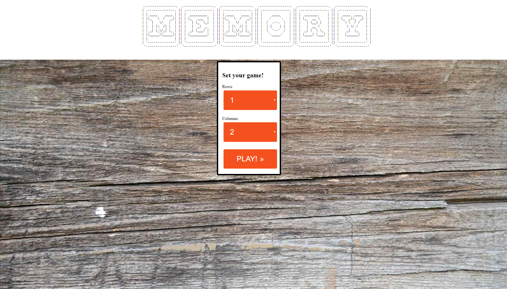
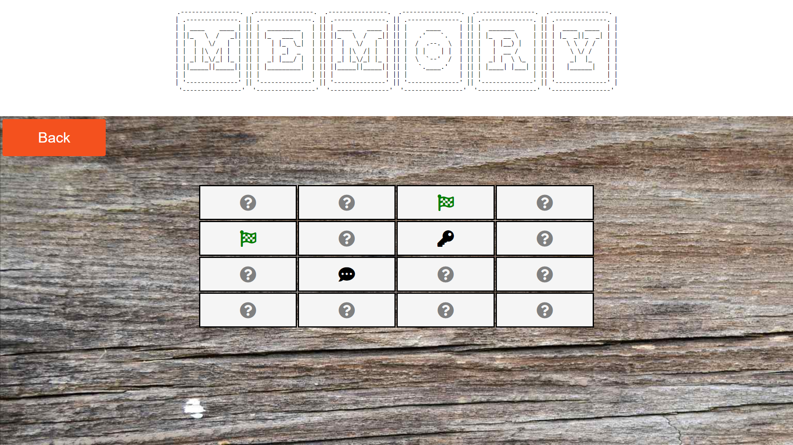

# Web Memory Game

It's a Python server for playing memory game online for one player.

## Installation

Use the package manager [pip](https://pip.pypa.io/en/stable/) to install flask.

```bash
pip install flask
```

## Usage

Unzip this into folder and then open there terminal and run command:
```
python server.py
```

## Screenshots



